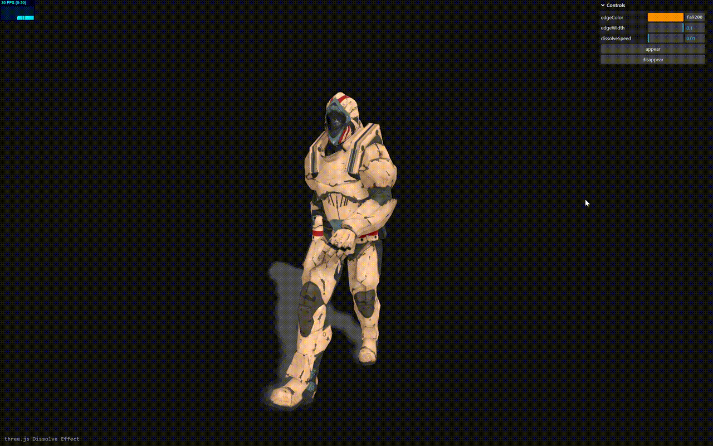
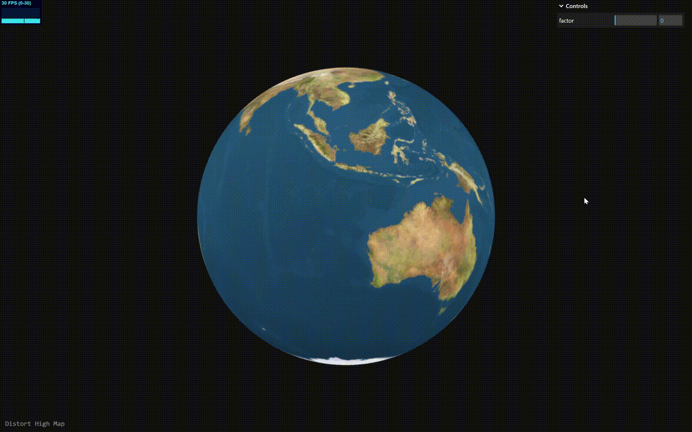

# three-chamber

A repository of creative and practical experiments using Three.js

# How to run

All examples use vanilla JavaScript and are primarily for experimental purposes.

1. Install Depencencies

```shell
pnpm i
```

2. Launch Asset Server

```shell
cd assets && http-server -p 2000 --cors
```

3. Start dev server

```shell
pnpm run start
```

# My Blog

Find more in my blog : [juejin](https://juejin.cn/user/46634010687316/posts)

# Featured Projects

-   **Dissolve Effect**

    Custom dissolve shader driven by Three.js onBeforeCompile for art-directed fades

    [Preview](https://wwjll.github.io/three-chamber/examples/bundle/dissolveEffect.html)

    

-   **Camera Editor**

    Spline-based camera animation editor for smooth, programmable shots

    [Preview](https://wwjll.github.io/three-chamber/examples/bundle/cameraEditor.html)

    

-   **Bim Animation**

    Lightweight BIM building animation controller with timeline-friendly motion

    [Preview](https://wwjll.github.io/three-chamber/examples/bundle/buildingAnimation.html)

    

-   **Distorted Highmap**

    Heightmap-driven distortion effect using custom shader passes

    [Preview](https://wwjll.github.io/three-chamber/examples/bundle/distortHighMap.html)

    

-   **Path-Tracing**

    Simple path-tracing demo built on Three.js.
    You may need to set Chrome's ANGLE backend to OpenGL for compatibility.

    [Preview](https://wwjll.github.io/three-chamber/examples/bundle/pathTracing.html)

    

-   **DH Links**

    Denavit-Hartenberg robotic arm modeling demo.
    Shows DH links clearly, with connections rendered as 3d Bezier curves.
    In MDH mode, I add an extra parameter set so there is an end joint for consistency.
     I started using Codex for this example.

    [Preview](https://wwjll.github.io/three-chamber/examples/bundle/dhLinks.html)

    
