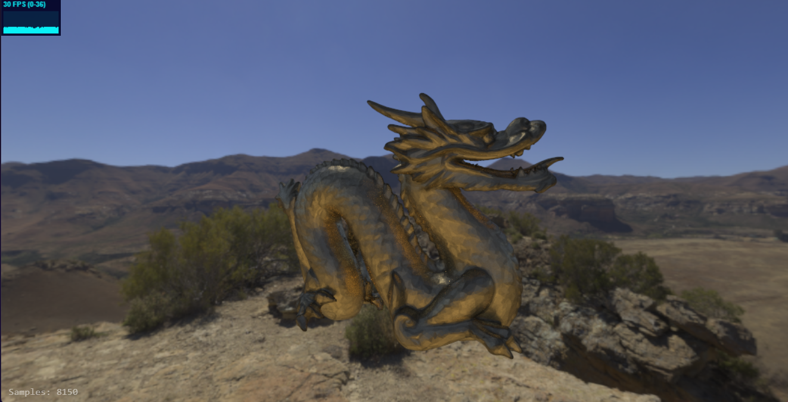

# three-chamber

A repository of creative and practical experiments using Three.js

# How to run

```shell
pnpm run start
```

Static asset server runs on port `2000` by default.
If assets fail to load, check whether the asset server is running and whether port `2000` is reachable.

# My Blog

Find more in my blog : [juejin](https://juejin.cn/user/46634010687316/posts)

# Featured Projects

-   **Dissolve**

    Custom dissolve shader driven by Three.js onBeforeCompile for art-directed fades

    [Preview](https://wwjll.github.io/three-chamber/examples/bundle/dissolve.html)

    

-   **Camera Editor**

    Spline-based camera animation editor for smooth, programmable shots

    [Preview](https://wwjll.github.io/three-chamber/examples/bundle/cameraEditor.html)

    

-   **TowerMotion**

    Lightweight BIM building animation controller with timeline-friendly motion

    [Preview](https://wwjll.github.io/three-chamber/examples/bundle/towerMotion.html)

    

-   **HeightWarp**

    Heightmap-driven distortion effect using custom shader passes

    [Preview](https://wwjll.github.io/three-chamber/examples/bundle/heightWarp.html)

    

-   **Path-Tracing**

    Simple path-tracing demo built on Three.js.
    You may need to set Chrome's ANGLE backend to OpenGL for compatibility.

    [Preview](https://wwjll.github.io/three-chamber/examples/bundle/pathTracing.html)

    

-   **DH Links**

    Denavit-Hartenberg robotic arm modeling demo.  
    Shows DH links clearly, with connections rendered as 3d Bezier curves.  
    In MDH mode, I add an extra parameter set so there is an end joint for consistency.  
     I started using Codex for this example.  

    [Preview](https://wwjll.github.io/three-chamber/examples/bundle/dhLinks.html)

    

-   **Simple IK**

    Position/rotation target driven IK demo with draggable end-effector control.  
    Math principle: use task error $e=[e_p,e_r]$, where $e_p=p_t-p(q)$ and $e_r$ is orientation error from quaternion difference.  
    For revolute joint $i$, Jacobian columns are $J_{v,i}=a_i \times (p-p_i)$ and $J_{w,i}=a_i$, then update with gradient step $\Delta q=\alpha J^T e$.

    [Preview](https://wwjll.github.io/three-chamber/examples/bundle/ik.html)

    
