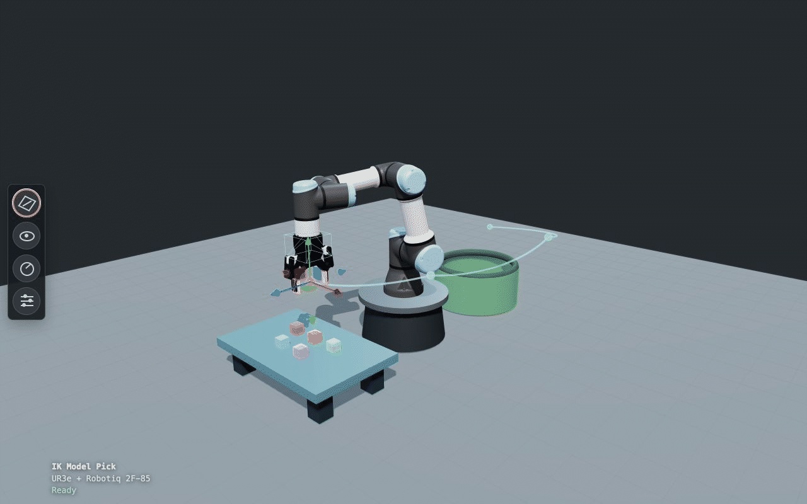
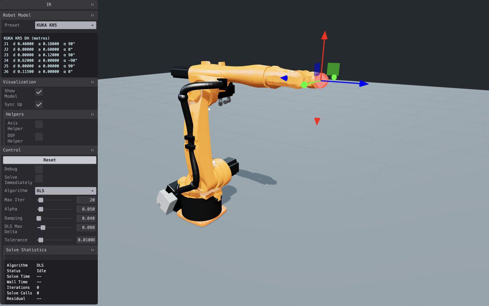
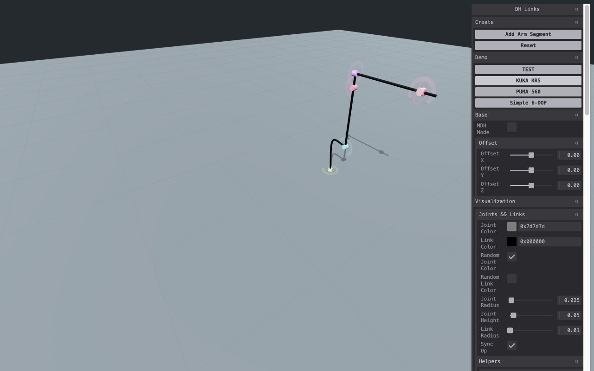
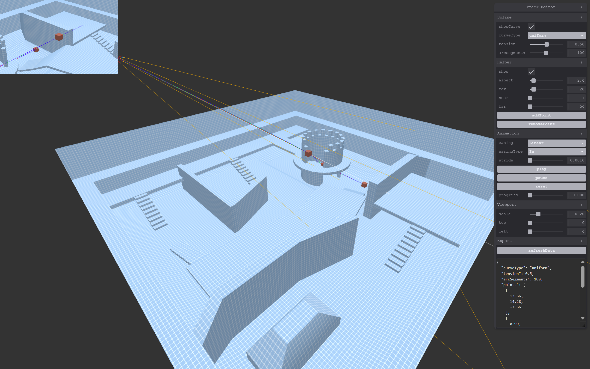
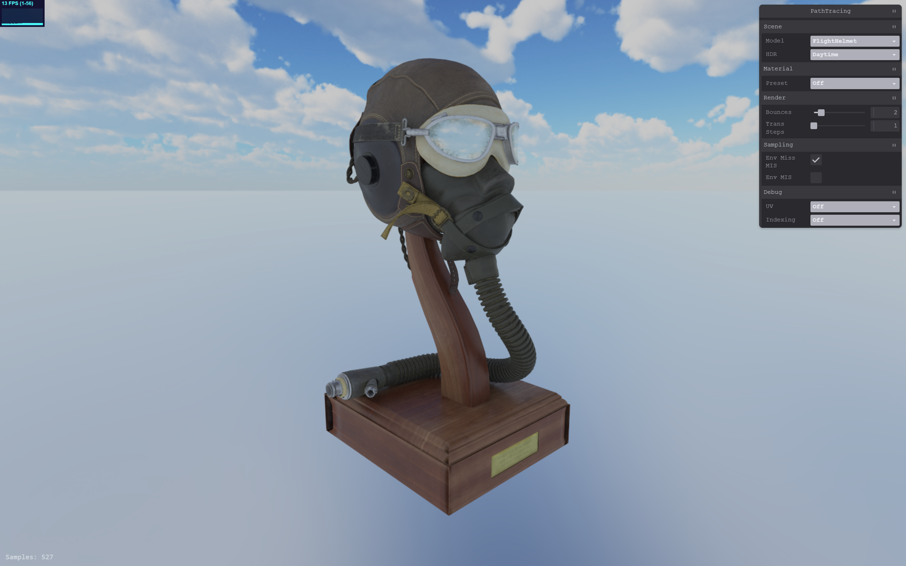
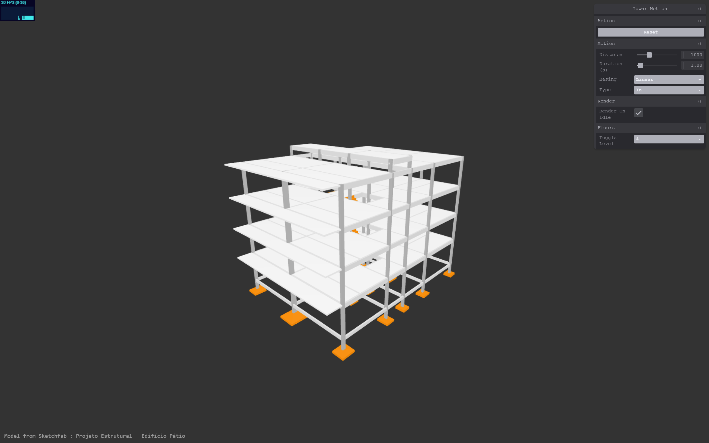
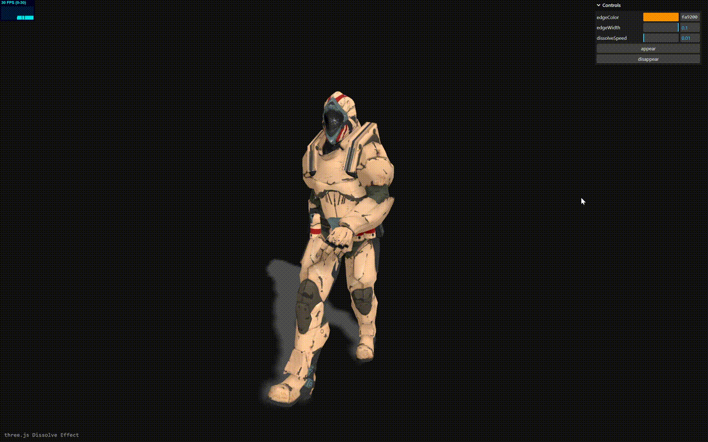

# three-chamber

A repository of creative and practical experiments using Three.js.

# How to run

```shell
pnpm run start
```

Static asset server runs on port `2000` by default.
If assets fail to load, check whether the asset server is running and whether port `2000` is reachable.

# My Blog

Find more in my blog : [juejin](https://juejin.cn/user/46634010687316/posts)

# Featured Projects

## Kinematic and Robotic

-   **IK Model Pick**

    UR3e + Robotiq pick-and-place demo with recorded full-chain keyframes, configurable orientation constraints, DLS IK, staged motion, and physics-based cube grasp/release.

    [Preview](https://wwjll.github.io/three-chamber/ikModelPick.html)

    

-   **Simple IK**

    Position-target IK demo with draggable end-effector control, selectable DLS/basic IK, and convergence statistics.
    Supports KUKA KR5 and UR3e robot profiles with procedural or loaded model visualization.

    [Preview](https://wwjll.github.io/three-chamber/ik.html)

    

-   **DH Links**

    Denavit-Hartenberg robotic arm modeling demo.  
    Shows lit DH links clearly, with connections rendered as 3D Bezier curves.
    In MDH mode, I add an extra parameter set so there is an end joint for consistency.  
    I started using Codex for this example.  

    [Preview](https://wwjll.github.io/three-chamber/dhLinks.html)

    

## Editors

-   **Camera Editor**

    Spline-based camera animation editor for smooth, programmable shots

    [Preview](https://wwjll.github.io/three-chamber/cameraEditor.html)

    

# Rendering

-   **Path-Tracing**

    A path-tracing demo built on Three.js.

    [Preview](https://wwjll.github.io/three-chamber/pathTracing.html)

    

# Animation

-   **TowerMotion**

    Lightweight BIM building animation controller with timeline-friendly motion

    [Preview](https://wwjll.github.io/three-chamber/towerMotion.html)

    
    
# Visual Effects

-   **Dissolve**

    Custom dissolve shader driven by Three.js onBeforeCompile for art-directed fades

    [Preview](https://wwjll.github.io/three-chamber/dissolve.html)

    
